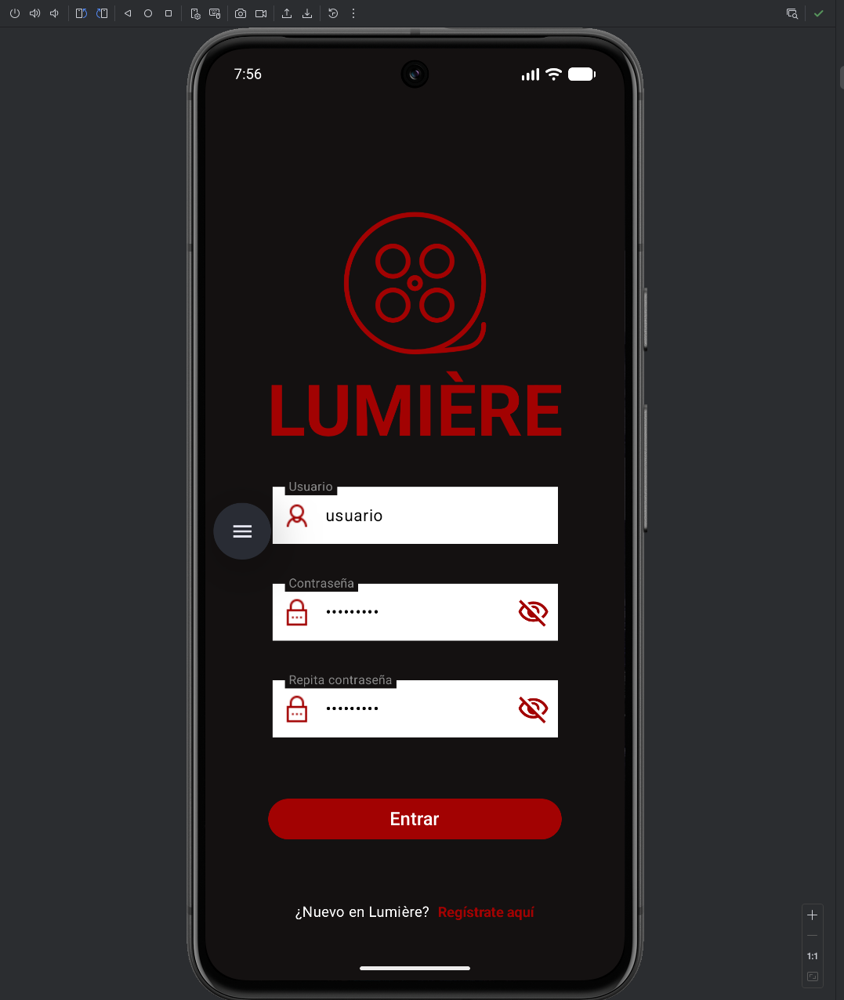
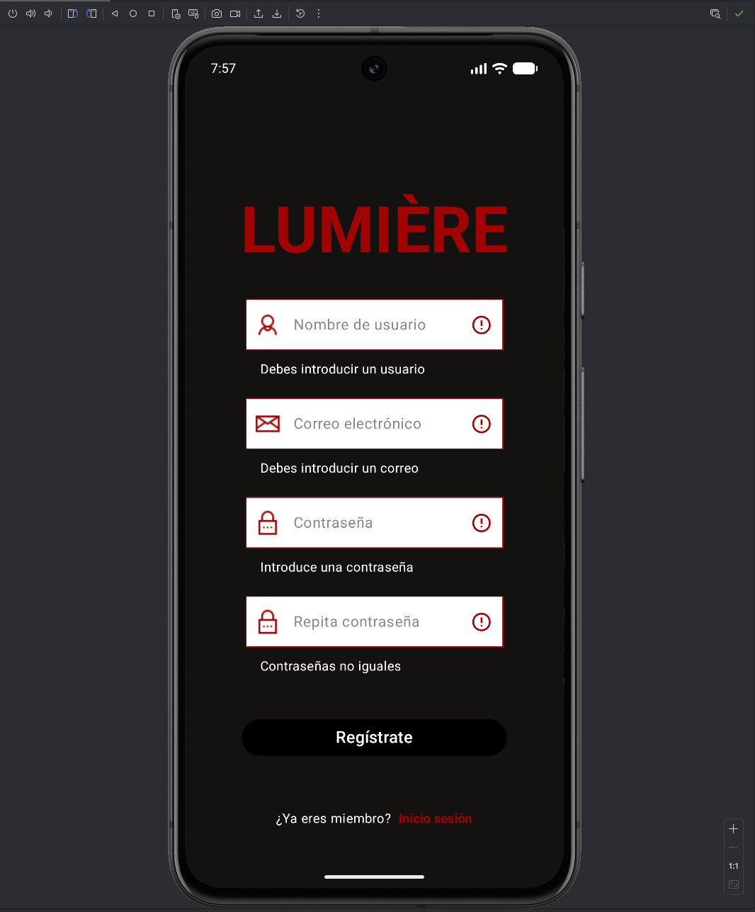
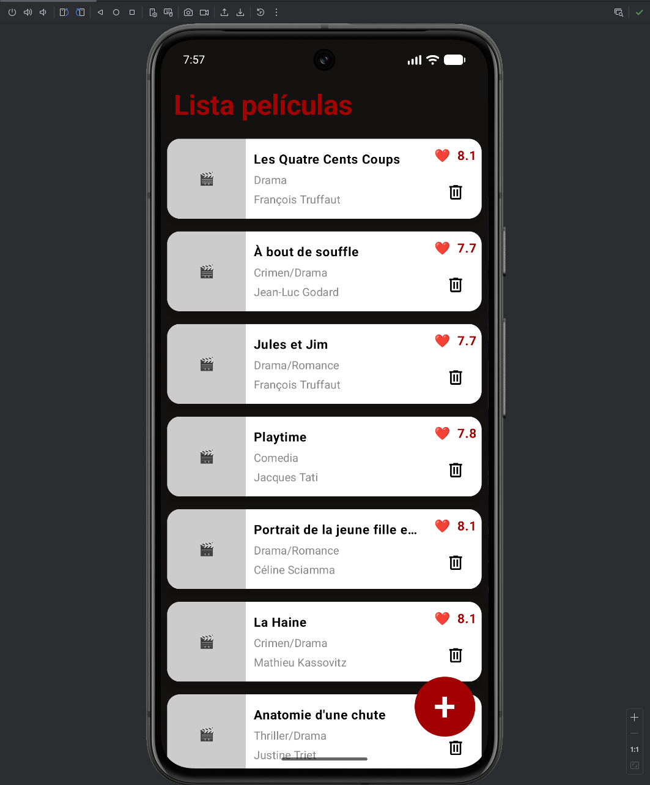
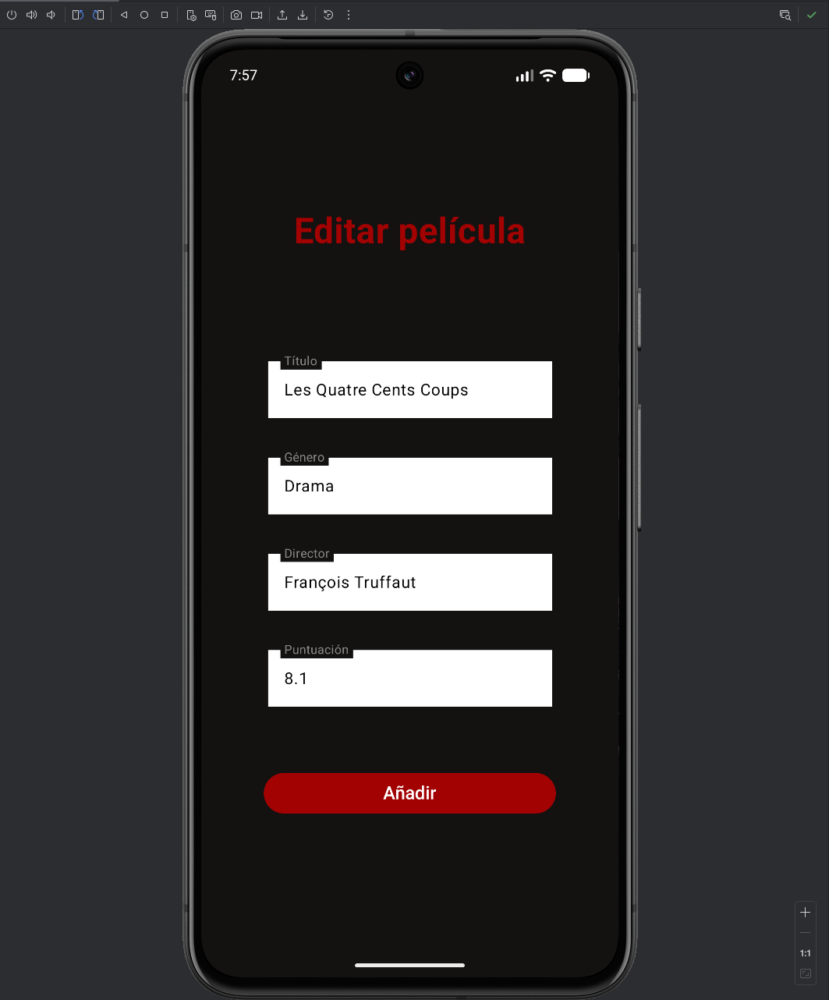

# Lumière

Lumière es una aplicación móvil diseñada para cinéfilos que desean gestionar su catálogo personal de películas. Con una interfaz minimalista y elegante en tonos oscuros, la aplicación permite llevar un control detallado de tus obras favoritas del séptimo arte.

## Características principales

**-Autenticación de Usuarios:** Pantallas de Login y Registro con validación de formularios (correo, contraseñas coincidentes y campos obligatorios).

**-Catálogo Personalizado:** Visualización de películas con metadatos como género, director y puntuación (Rating).

**-Gestión CRUD:** Operaciones completas para agregar, editar y eliminar registros de la colección.

**-UI Cinema Noir:** Estética basada en alto contraste (rojo sobre negro) para una experiencia inmersiva.

## Arquitectura de Navegación

El proyecto utiliza Navegación 3 para gestionar el flujo de pantallas de forma declarativa y segura, estructurándose de la siguiente manera:

**-Gráfico de navegación:** Definición centralizada de rutas para evitar acoplamiento entre pantallas.

**-Deep Linking & Argumentos:** Paso de datos seguro (type-safe) entre la lista principal y la pantalla de edición de películas.

**-Gestión de Backstack:** Control preciso del historial para asegurar que el usuario no regrese a las pantallas de inicio de sesión una vez autenticado.

**-Transiciones:** Fluidez en el cambio entre el registro de usuarios y el tablero principal.

## Stack Tecnológico

**-Lenguaje/Framework:** Kotlin

**-Navegación:** Navegación 3 (Jetpack / Compose)

**-Diseño:** Material Design 3 (con personalización Dark Theme).

##  Vista Previa

  
  
  
  
  
  
  

